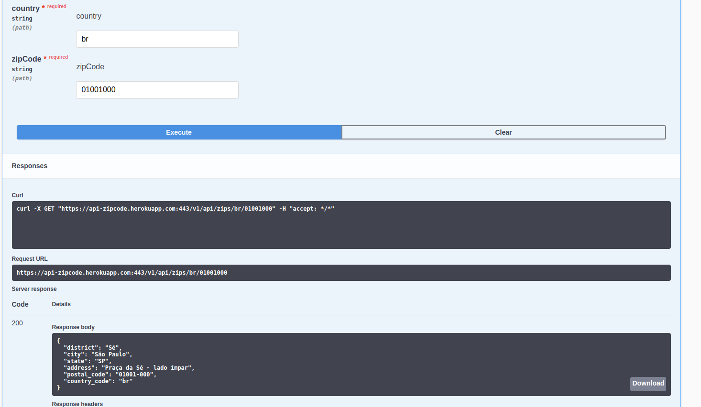
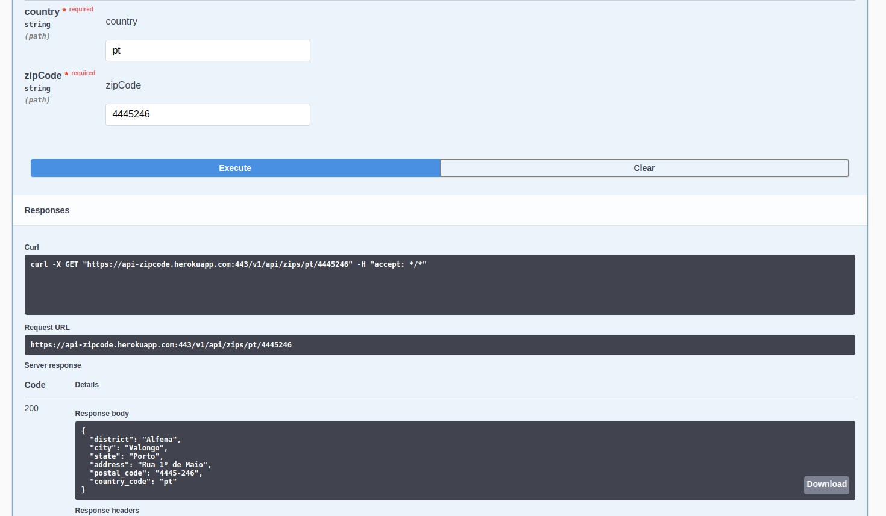

# API ZIPCODE

In this project do you can find a address by zipcode, in this time are only Brazil and Portugal.

for a Brazil zip code i used http://apicep.com
and for a Portgual zip code i used api https://duminio.com/

heroku.com

use BR or PT 

Zip code Brazil : 01001000
Zip code Portugal : 4445246

[https://api-zipcode.herokuapp.com/swagger-ui/](https://api-zipcode.herokuapp.com/swagger-ui/)

**RUN SONAR**  
mvn sonar:sonar -Dsonar.projectKey=api-zipcode -Dsonar.host.url=http://127.0.0.1:9000 -Dsonar.login=<YOUR_KEY>

**Docker composer**
- image: 'mtobbias/api-zipcode:0.0.1'
- image: sonarqube:community
- image: redis:alpine3.15

